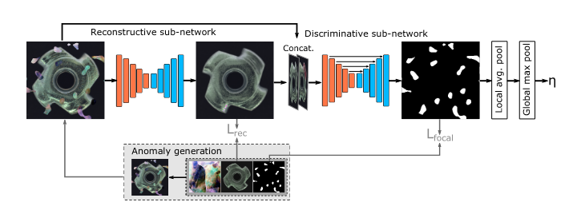

# DRÆM – A discriminatively trained reconstruction embedding for surface anomaly detection

This is the implementation of the [DRAEM](https://arxiv.org/pdf/2108.07610v2.pdf) paper.

Model Type: Segmentation

## Description

DRAEM is a reconstruction based algorithm that consists of a reconstructive subnetwork and a discriminative subnetwork. DRAEM is trained on simulated anomaly images, generated by augmenting normal input images from the training set with a random Perlin noise mask extracted from an unrelated source of image data. The reconstructive subnetwork is an autoencoder architecture that is trained to reconstruct the original input images from the augmented images. The reconstructive submodel is trained using a combination of L2 loss and Structural Similarity loss. The input of the discriminative subnetwork consists of the channel-wise concatenation of the (augmented) input image and the output of the reconstructive subnetwork. The output of the discriminative subnetwork is an anomaly map that contains the predicted anomaly scores for each pixel location. The discriminative subnetwork is trained using Focal Loss.

## Architecture

## Usage

`python tools/train.py --model draem`

## Benchmark

Benchmarking results are not yet available for this algorithm. Please check again later.
