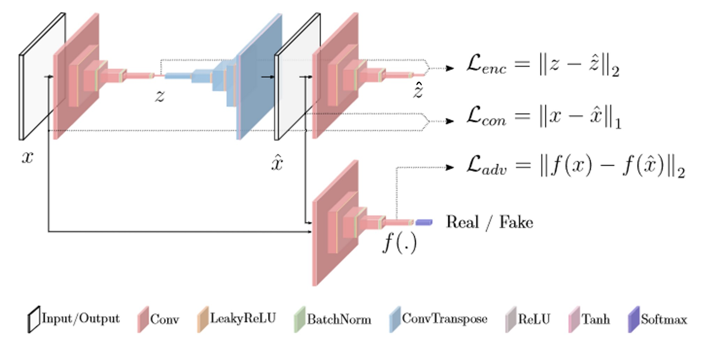

# GANomaly: Semi-Supervised Anomaly Detection via Adversarial Training

This is the implementation of the [GANomaly](https://arxiv.org/abs/1805.06725) paper.

Model Type: Classification

## Description

GANomaly uses the conditional GAN approach to train a Generator to produce images of the normal data. This Generator consists of an encoder-decoder-encoder architecture to generate the normal images. The distance between the latent vector $z$ between the first encoder-decoder and the output vector $\hat{z}$ is minimized during training.

The key idea here is that, during inference, when an anomalous image is passed through the first encoder the latent vector $z$ will not be able to capture the data correctly. This would leave to poor reconstruction $\hat{x}$ thus resulting in a very different $\hat{z}$. The difference between $z$ and $\hat{z}$ gives the anomaly score.

## Architecture

## Usage

`python tools/train.py --model ganomaly`

## Benchmark

All results gathered with seed `42`.

## [MVTec Dataset](https://www.mvtec.com/company/research/datasets/mvtec-ad)

### Image-Level AUC

### Image F1 Score
