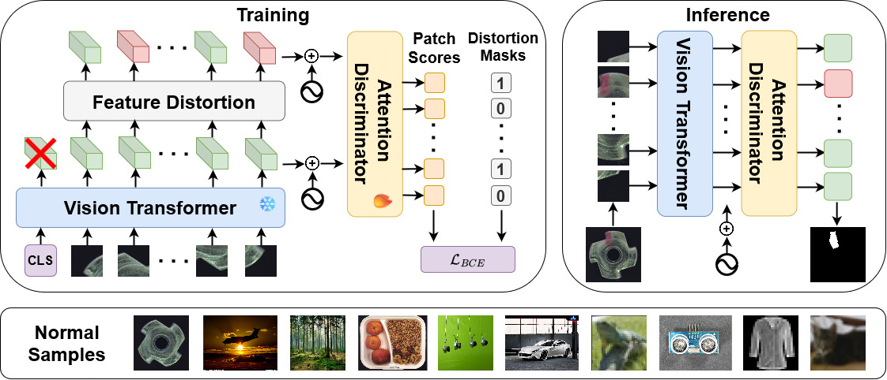

# GeneralAD: Anomaly Detection Across Domains by Attending to Distorted Features

This is the implementation of the [GeneralAD](https://arxiv.org/abs/2407.12427) paper.

Model Type: Segmentation

## Description

GeneralAD is a discriminative anomaly detection method that operates across semantic, near-distribution, and industrial settings with minimal per-task adjustments. It leverages the patch-based structure of Vision Transformer hidden states and introduces a self-supervised anomaly generation module that constructs pseudo-anomalous samples by applying noise injection, shuffling, and copying operations to patch features. An attention-based discriminator is trained to score every patch in the image, enabling both accurate image-level anomaly identification and interpretable anomaly map generation.

This anomalib integration ports the core method from the original
[GeneralAD repository](https://github.com/LucStrater/GeneralAD) into anomalib's
standard model interface so it can be trained with `Engine`, used from the CLI,
and evaluated with anomalib's built-in metrics and post-processing pipeline.

## Architecture



## Usage

`anomalib train --model GeneralAD --data MVTecAD --data.category <category>`

## Upstream comparison

To compare anomalib GeneralAD against the original implementation on one MVTec AD
category, run [`tools/compare_general_ad_upstream.py`](../../../../../tools/compare_general_ad_upstream.py)
on a GPU machine with two prepared Python environments: one for anomalib and one
for the upstream repository.

The script aligns the main upstream `run_general_ad.job` settings for MVTec AD:

- backbone `vit_large_patch14_dinov2.lvd142m`
- layer `24`
- `image_size=518`
- `hidden_dim=2048`
- `lr=5e-4`
- `lr_decay_factor=0.2`
- `weight_decay=1e-5`
- `noise_std=0.25`
- `dsc_layers=1`
- `dsc_heads=4`
- `dsc_dropout=0.1`
- `num_fake_patches=-1`
- `fake_feature_type=random`
- `top_k=10`
- `epochs=160`

It writes per-run metrics plus a compact JSON/Markdown summary under
`results/general_ad_compare/<category>/`.

## Local reproduction

On 2026-04-10, we verified that the anomalib `GeneralAD` integration reproduces
the upstream results on MVTec AD `toothbrush` when the evaluation is configured
to match the upstream scoring pipeline.

| Run | image_AUROC | pixel_AUROC |
| --- | ---: | ---: |
| Upstream GeneralAD (original repo) | `0.994` | — |
| Anomalib (default post-processing) | `0.967` | `0.962` |
| **Anomalib (no score normalization)** | **`0.997`** | `0.962` |

The key finding is that anomalib's default `PostProcessor` normalizes and clamps
`pred_score` to `[0, 1]` before the `Evaluator` computes AUROC during testing.
This normalization (`((score - threshold) / (max - min)) + 0.5`, then
`clamp(0, 1)`) is a non-monotonic transformation that can change rank ordering
and therefore AUROC. The upstream repo computes AUROC directly on raw
discriminator logits with no post-processing.

To reproduce upstream-matching results, disable normalization in the
post-processor:

```python
from anomalib.post_processing import PostProcessor

model = GeneralAD(
    ...,
    post_processor=PostProcessor(enable_normalization=False),
)
```

Or use the runner script with `--no-post-process`:

```bash
python tools/run_general_ad_anomalib.py \
    --category toothbrush \
    --mvtec-root /path/to/mvtecad \
    --output-dir results/general_ad/toothbrush \
    --drop-last \
    --no-post-process
```

### Other alignment details

- The upstream train loader uses `drop_last=True`. Pass `--drop-last` to match.
- Checkpoint selection monitors `image_AUROC` on `val_split_mode=SAME_AS_TEST`,
  matching the upstream behaviour of validating on the test set.
